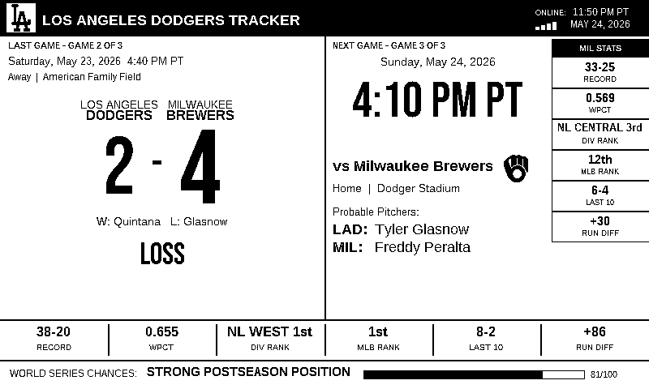
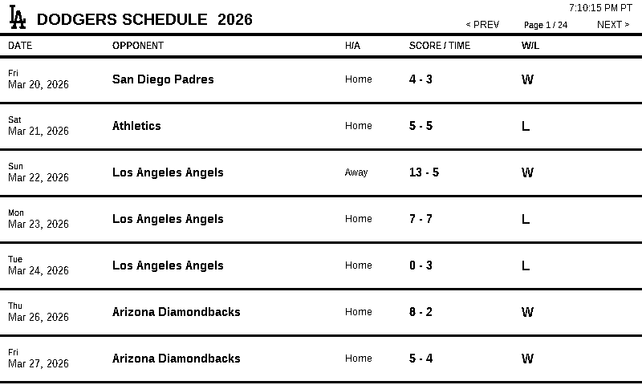
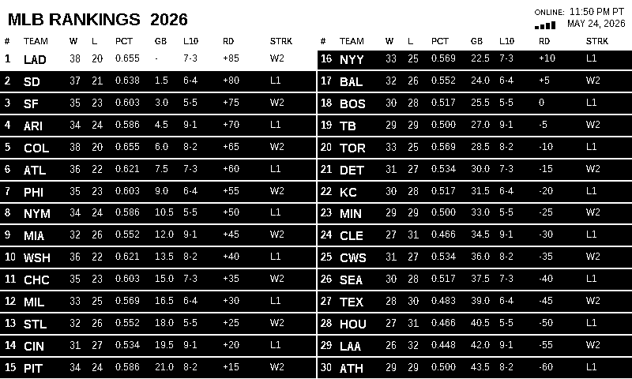
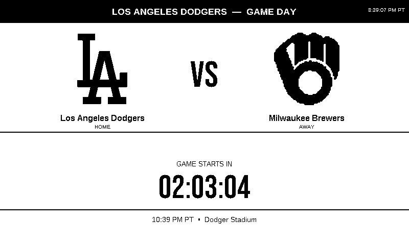
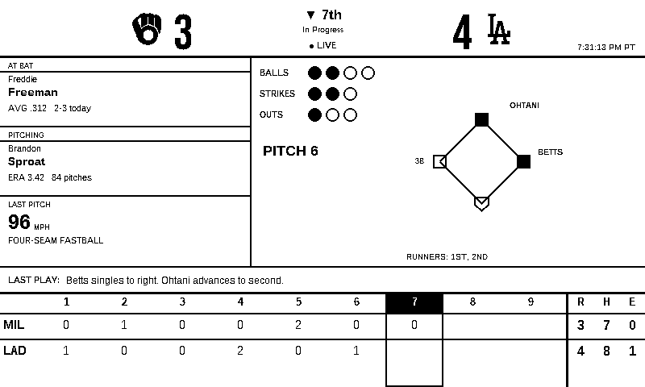

# MLB Tracker

MLB Tracker is a Raspberry Pi e-paper dashboard for baseball fans. It shows
team briefing info, schedule, MLB rankings, pregame/live game screens, live
scores, inning state, pitch count, runners, and e-paper friendly full-screen
partial refresh.

Fresh installs require each user to choose their own team and timezone.

## Parts List

- [Waveshare 7.5-inch V2 black-and-white e-paper display](https://amzn.to/49SbFdX)
- [Waveshare driver PCB / HAT for Raspberry Pi](https://amzn.to/4uCjHQM)

## Hardware

- Raspberry Pi Zero W or Zero 2 W
- Waveshare 7.5-inch V2 black-and-white e-paper display
- Python driver: `waveshare_epd.epd7in5_V2`
- Optional GPIO buttons:
  - Left: GPIO 5
  - Center: GPIO 6
  - Right: GPIO 13
  - Live game: GPIO 26

## Features

- First-run setup wizard for team and timezone selection
- Briefing screen with last game, next game, record, rankings, and season outlook
- Schedule screen with button navigation
- MLB rankings screen
- Pregame screen before first pitch
- Automatic live-game mode when the selected team has a game in progress
- Manual live-game button on GPIO 26
- Live button opens the pregame VS screen on game day if the game has not started
- Live button shows a no-live-game popup when there is no live or same-day upcoming game
- Live score, inning, count, outs, pitch number, runners, runner names, and line score
- Live game data can poll about once per second, with a configurable broadcast delay
- Extra-innings line score view
- Full-screen partial refresh for fast e-paper updates without constant full flashes
- Per-page display inversion support for sharper schedule/rankings output

## Button Wiring

Buttons are optional, but the default GPIO layout is:

| Button | GPIO | Action |
| --- | ---: | --- |
| Left | 5 | Scroll schedule backward |
| Center | 6 | Cycle screens, or exit live mode back to main screen |
| Right | 13 | Scroll schedule forward |
| Live | 26 | Jump to live game mode when a game is in progress |

Long-press behavior is supported for the schedule navigation buttons.

## Screenshots

Example screenshots are shown with one selected team. During setup, each user
chooses their own MLB team and timezone.

### Briefing



### Schedule



### MLB Rankings



### Pregame



### Live Game



## Install

Use the packaged installer zip from a release:

```bash
unzip mlb-tracker-installer.zip
cd mlb-tracker-installer
sudo ./install.sh
```

The installer copies the app to `~/mlb-tracker`, installs dependencies, enables
SPI, installs the Waveshare driver, creates the `mlb-tracker` systemd service,
and runs the setup wizard.

See `README_INSTALL.md` for fresh-image details.

## Reconfigure Team Or Timezone

```bash
cd ~/mlb-tracker
sudo systemctl stop mlb-tracker
python3 scripts/setup_wizard.py --force
sudo systemctl start mlb-tracker
```

## Service Commands

```bash
sudo systemctl restart mlb-tracker
sudo systemctl status mlb-tracker --no-pager
journalctl -u mlb-tracker -n 150 --no-pager -l
```
