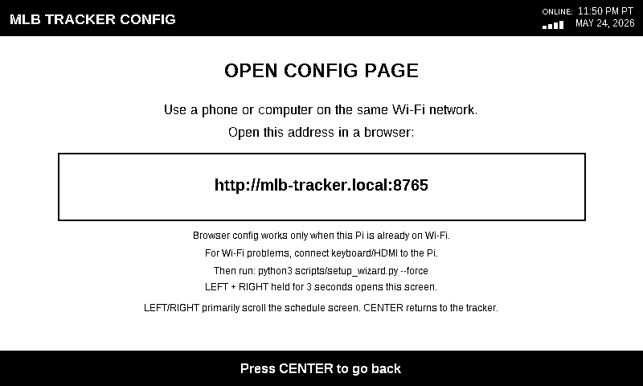

# MLB Tracker

MLB Tracker turns a Raspberry Pi and Waveshare e-paper display into a simple
baseball dashboard. Pick your team during setup, and it shows the latest team
status, schedule, rankings, pregame countdowns, and live game updates.

## Parts

- [Waveshare 7.5-inch V2 black-and-white e-paper display](https://amzn.to/49SbFdX)
- [Waveshare driver PCB / HAT for Raspberry Pi](https://amzn.to/4uCjHQM)
- Raspberry Pi Zero W or Raspberry Pi Zero 2 W
- MicroSD card
- Raspberry Pi power supply
- Optional momentary push buttons

## What It Does

- Tracks any MLB team you choose.
- Shows last game, next game, schedule, rankings, and live game info.
- Automatically switches to the live game screen when your team is playing.
- Includes setup and reconfigure options for team, timezone, and Wi-Fi.

## Button Wiring

Buttons are optional.

| Button | GPIO | Action |
| --- | ---: | --- |
| Left | 5 | Scroll schedule backward |
| Center | 6 | Cycle screens, or return from live/config screens |
| Right | 13 | Scroll schedule forward |
| Live | 26 | Open live game, pregame countdown, or no-game message |
| Left + Right | 5 + 13 | Hold both for 3 seconds to open config mode |

## Screenshots

Example screenshots shown with Los Angeles Dodgers chosen as the tracked team.

### Briefing


### Schedule


### MLB Rankings


### Pregame


### Live Game


### Config



## Install From A Fresh Raspberry Pi Image

These steps are written for beginners and assume you are starting with a blank
microSD card.

### 1. Flash The SD Card

1. Install [Raspberry Pi Imager](https://www.raspberrypi.com/software/).
2. Open Raspberry Pi Imager.
3. Choose your Raspberry Pi model.
4. Choose Raspberry Pi OS Lite 32-bit. This is the non-desktop version.
5. Choose your microSD card.
6. Open OS customization before writing the card.
7. Set the hostname to `mlb-tracker`.
8. Set your username and password.
9. Configure Wi-Fi with your network name, password, country, and timezone.
10. Enable SSH.
11. Write the image to the SD card.

The hostname matters because the install commands use:

```bash
ssh pi@mlb-tracker.local
```

If you choose a username other than `pi`, use that username instead.

### 2. Boot The Raspberry Pi

1. Put the SD card into the Raspberry Pi.
2. Connect the Waveshare display and driver board.
3. Power on the Raspberry Pi.
4. Wait a few minutes for the first boot to finish. It is normal for SSH to
   take several minutes before it works the first time.

### 3. Connect With SSH

From your computer, open Terminal and run:

```bash
ssh pi@mlb-tracker.local
```

If that does not work, find the Pi's IP address in your router and run:

```bash
ssh pi@YOUR_PI_IP_ADDRESS
```

After SSH connects, the commands below are typed into the Raspberry Pi terminal.

### 4. Install MLB Tracker

Copy and paste this whole block into the Raspberry Pi terminal:

```bash
sudo apt update
sudo apt install -y curl unzip
curl -L -o mlb-tracker-installer.zip https://github.com/RETROCUTION/mlb-tracker/releases/download/v0.1.0/mlb-tracker-installer.zip
unzip mlb-tracker-installer.zip
cd mlb-tracker-installer
sudo ./install.sh
```

What this does:

- Updates the Raspberry Pi package list.
- Installs the download/unzip tools.
- Downloads the MLB Tracker installer from GitHub.
- Unzips the installer.
- Runs the installer.

The installer sets up Python dependencies, enables SPI, installs the Waveshare
e-paper driver, copies MLB Tracker to `~/mlb-tracker`, creates the
`mlb-tracker` system service, and starts the setup wizard.

Choose your team and timezone when prompted. After setup, MLB Tracker starts
automatically and will also start after reboot.

## Reconfigure Team, Timezone, Or Wi-Fi

### Button Method

Use this when the Raspberry Pi is already connected to Wi-Fi.

Hold Left and Right together for 3 seconds. The display shows a local config
address:

```text
http://mlb-tracker.local:8765
```

Open that address on a phone or computer connected to the same Wi-Fi network.
The config page has dropdowns for team and timezone.

This method cannot help if the Pi is not connected to Wi-Fi, because your
phone or computer will not be able to reach `mlb-tracker.local`.

### Keyboard Or Terminal Method

Use this for Wi-Fi changes, team changes, timezone changes, or Wi-Fi recovery.

If Wi-Fi still works, SSH into the Raspberry Pi. If Wi-Fi is broken, connect a
keyboard and HDMI display to the Pi, log in, and run:

```bash
cd ~/mlb-tracker
sudo systemctl stop mlb-tracker
python3 scripts/setup_wizard.py --force
sudo systemctl start mlb-tracker
```

What this does:

- `cd ~/mlb-tracker` opens the installed project folder.
- `sudo systemctl stop mlb-tracker` pauses the display service.
- `python3 scripts/setup_wizard.py --force` opens the setup wizard for Wi-Fi,
  team, and timezone.
- `sudo systemctl start mlb-tracker` starts the display service again.

## Service Commands

Check if MLB Tracker is running:

```bash
sudo systemctl status mlb-tracker --no-pager
```

Restart MLB Tracker:

```bash
sudo systemctl restart mlb-tracker
```

View recent logs:

```bash
journalctl -u mlb-tracker -n 150 --no-pager -l
```

The logs are useful when the display is blank, Wi-Fi is not connected, or the
MLB API cannot be reached.

## Update MLB Tracker

Download the newest release zip, unzip it, and run the installer again:

```bash
curl -L -o mlb-tracker-installer.zip https://github.com/RETROCUTION/mlb-tracker/releases/download/v0.1.0/mlb-tracker-installer.zip
unzip -o mlb-tracker-installer.zip
cd mlb-tracker-installer
sudo ./install.sh
```

The installer keeps your existing settings, cache, and output folders unless
you run the setup wizard again.
